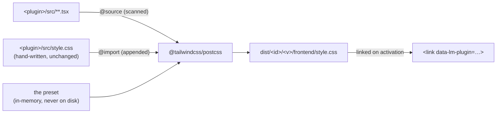

# Tailwind CSS in plugins

> *"wait our plugins dont support tailwind????? next on the list"*

**Answer: they can, and it takes one option on the reference Vite config.** Nothing in the
kernel, the loader, the manifest, the import map or the server changes. A plugin's
`style.css` stops being *copied* and starts being *compiled* — and Tailwind's output is
still a plain sibling stylesheet the kernel links on activation, exactly as SPEC §6.4
describes it.

Everything below was measured against Tailwind **4.3.3** (the current release) with the
real kernel token set, not reasoned about. Where a snippet appears, it compiled; where a
number appears, it came off a build. Two findings are load-bearing and neither is
obvious, so they are stated up front:

1. **Utilities must be emitted *unlayered*.** Tailwind's documented utilities-only recipe
   puts them in `@layer utilities`, and **unlayered CSS beats layered CSS regardless of
   specificity or order**. The app shell's `styles.css` styles bare `button`, `input`,
   `a` and `summary` unlayered — so a layered `.bg-accent` on a `<button>` silently loses
   to `button { background: var(--lm-bg-raised) }`. Verified in a browser: layered
   utilities computed to the app's 6 px radius / white background / 1 px border; the same
   declarations unlayered computed to the utility's values.
2. **`prefix()` is forbidden.** Tailwind v4's prefix renames *theme variables* to
   `--<prefix>-*`. With the obvious choice, `prefix(lm)`, the emitted theme block is
   literally `:root { --lm-radius-lg: var(--lm-radius-lg); --lm-font-sans:
   var(--lm-font-sans); … }` — self-referential custom properties, invalid at
   computed-value time, which **unsets the kernel's own tokens for the whole document**.
   A plugin's stylesheet would take down the app's theme. (Prefixes are also restricted
   to lowercase ASCII letters, so `doc-list` and `shell-ui` could not use their ids
   anyway.)

---

## 1. What a plugin's CSS is today

Three facts, from the code:

- `plugins/base/_shared/vite.plugin-config.mjs` — the `lm-plugin-package` plugin's
  `closeBundle` hook does `copyFileSync(<root>/src/style.css, <out>/frontend/style.css)`.
  **Vite never sees the CSS**: it is not imported by the module, there is no PostCSS
  pass, no transform, nothing. That is deliberate (the file's own comment: *"`style.css`
  is copied, not imported"*) and it is the one thing Tailwind has to change.
- `web/app/src/loader/loader.ts:176` — `linkStylesheet()` appends one
  `<link rel="stylesheet" data-lm-plugin="<id>">` per plugin at activation, in
  topological order, *after* the app's own bundled `styles.css`.
- `web/kernel/src/runtime/theme.ts` — `writeTokens()` sets the 25 `--lm-*` custom
  properties as **inline styles on `document.documentElement`**, plus `color-scheme` and
  `data-lm-scheme="light|dark"`. Themes are token *layers* over that; a custom theme is a
  different set of values for the same names.

So the house idiom is: prefixed classes, every value a `var(--lm-*)`, themes for free.
`grep` says no base stylesheet ever reads `data-lm-scheme` — dark mode is *entirely* the
token values changing underneath. That matters in §5.

Current cost of that idiom, for reference (14 base plugins, source bytes / gzip):

| | raw | gzip |
|---|---|---|
| `admin` (largest) | 15.6 KB | 4.1 KB |
| `settings` (median) | 8.4 KB | 2.7 KB |
| `settings`, comments stripped | 5.3 KB | 1.2 KB |
| all fourteen | 131 KB | — |

---

## 2. The blessed path (build-time, per plugin)



One compile, in the same `closeBundle` hook that copies today. The plugin's own
`style.css` is `@import`ed **last**, so hand-written rules still win ties against
utilities — the migration path for a plugin adding Tailwind to existing CSS is "nothing
moves".

### 2a. The preset — exact, verbatim

This is what the build prepends. It is not a file the author writes; shipping it as
`plugins/base/_shared/tailwind-preset.mjs` (a template string) keeps one copy for
fourteen base plugins and every third party that uses `pluginConfig`.

```css
/*
 * The blessed Tailwind preset for a Life Manager frontend plugin.
 *
 * Four decisions, each a consequence of how plugin CSS reaches the page:
 *
 * 1. Granular imports, no `preflight.css`. A reset per plugin would restyle the whole
 *    app — the app shell styles bare `button`/`input`/`a`/`summary` and every plugin's
 *    stylesheet is linked after it — and N plugins would ship N resets.
 * 2. No `layer(...)`. Unlayered declarations beat layered ones no matter the order, so
 *    a layered utility loses to the app shell's element rules. Utilities go unlayered
 *    and win on specificity (0,1,0 > 0,0,1) like any other class.
 * 3. `source(none)` + one explicit `@source`. Automatic detection walks up from the
 *    *current working directory*, which for `mise run plugins` is `web/` — it would
 *    scan the whole repo and emit every class in it into every plugin.
 * 4. `@theme inline`, mapped onto the kernel tokens. `inline` substitutes the value
 *    into the utility (`.bg-accent { background-color: var(--lm-accent) }`) instead of
 *    emitting a global `:root { --color-accent: … }` a plugin has no business writing.
 *    Themes and dark mode then follow for free: the kernel repaints `--lm-*` on
 *    `<html>` and every utility moves with it.
 */

@import "tailwindcss/theme.css" source(none);
@import "tailwindcss/utilities.css" source(none);

/*
 * `dark:` keyed on what the kernel actually writes. `ThemeController` sets
 * `data-lm-scheme` on `document.documentElement` (runtime/theme.ts `writeTokens`), and
 * that is the only signal a plugin may branch on — `prefers-color-scheme` is wrong,
 * because the user's explicit light/dark preference overrides the OS.
 *
 * Reach for it rarely: the token map below already flips with the scheme. `dark:` is
 * for the handful of things a token cannot express (an image swap, a border that only
 * exists on dark).
 */
@custom-variant dark (&:where([data-lm-scheme="dark"], [data-lm-scheme="dark"] *));

/*
 * The house breakpoint — one definition, `_shared/compact.ts`'s `COMPACT_MEDIA_QUERY`.
 * Written with media-queries-4 `or` rather than a comma: a comma inside
 * `@custom-variant` is split by Tailwind and emits invalid CSS (a bare
 * `.compact\:hidden (max-height: 480px) and (pointer: coarse) { … }` — measured).
 */
@custom-variant compact (@media ((max-width: 640px) or ((max-height: 480px) and (pointer: coarse))));

@theme inline {
  /* Surfaces and text */
  --color-bg: var(--lm-bg);
  --color-bg-subtle: var(--lm-bg-subtle);
  --color-bg-raised: var(--lm-bg-raised);
  --color-bg-overlay: var(--lm-bg-overlay);
  --color-border: var(--lm-border);
  --color-border-strong: var(--lm-border-strong);
  --color-text: var(--lm-text);
  --color-text-muted: var(--lm-text-muted);
  --color-text-inverse: var(--lm-text-inverse);

  /* Meaning */
  --color-link: var(--lm-link);
  --color-accent: var(--lm-accent);
  --color-accent-text: var(--lm-accent-text);
  --color-accent-subtle: var(--lm-accent-subtle);
  --color-danger: var(--lm-danger);
  --color-danger-text: var(--lm-danger-text);
  --color-warning: var(--lm-warning);
  --color-success: var(--lm-success);

  /* Affordances */
  --color-focus: var(--lm-focus-ring);
  --color-selection: var(--lm-selection);
  --shadow-1: var(--lm-shadow-1);
  --shadow-2: var(--lm-shadow-2);

  /* Type and metrics */
  --font-sans: var(--lm-font-sans);
  --font-mono: var(--lm-font-mono);
  --radius: var(--lm-radius);        /* the bare `rounded` utility */
  --radius-md: var(--lm-radius);
  --radius-lg: var(--lm-radius-lg);

  /*
   * The spacing *ramp*, not one value: `p-4` compiles to
   * `calc(var(--lm-space) * 4)`. `calc(var(--lm-space) * 0.5)` — the single most common
   * expression in the base stylesheets — is `gap-0.5`. A theme that changes `--lm-space`
   * rescales every margin in every Tailwind plugin, which is the whole point.
   */
  --spacing: var(--lm-space);
}

/*
 * SPEC §6.5's 44 px touch target. It cannot come from a theme namespace: mapping
 * `--container-tap` yields `w-tap` and nothing else — no `min-h-tap`, no `size-tap`
 * (measured). A `@utility` is the supported way, and it takes variants
 * (`compact:tap` works).
 */
@utility tap {
  min-height: var(--lm-tap-target);
  min-width: var(--lm-tap-target);
}
@utility tap-h {
  min-height: var(--lm-tap-target);
}
```

Compiled output for a one-line fixture, to show the shape:

```css
/*! tailwindcss v4.3.3 | MIT License | https://tailwindcss.com */
.flex        { display: flex; }
.gap-2       { gap: calc(var(--lm-space) * 2); }
.rounded-lg  { border-radius: var(--lm-radius-lg); }
.bg-accent   { background-color: var(--lm-accent); }
.p-4         { padding: calc(var(--lm-space) * 4); }
.mp-root     { color: var(--lm-text); }   /* the plugin's own CSS, appended */
```

No preflight, no layers, no `:root` writes for anything token-shaped, and every value is
a live `var(--lm-*)`. **A Tailwind plugin is theme-aware by construction** — more
reliably than a hand-written one, which can always hardcode a hex.

### 2b. The build hook — exact

`@tailwindcss/postcss` resolves `@import "tailwindcss/…"` **from the directory of the
CSS file it is handed**, and that is fatal for the base distribution: `plugins/base/` has
no `node_modules`, the repo root's is empty, and Node's walk-up therefore never reaches
`web/node_modules` where Vite and everything else lives. (Confirmed by the failure:
`Can't resolve 'tailwindcss/theme.css' in '…/myplugin/src'`.)

The fix costs nothing and writes no temp files: hand PostCSS a **virtual `from` path
inside the `node_modules` that contains Tailwind**. The file never has to exist — `from`
is only used for resolution and source maps.

```js
// plugins/base/_shared/vite.plugin-config.mjs — inside the `lm-plugin-package` plugin.
import { createRequire } from "node:module";
import { join } from "node:path";

/**
 * Compile `<root>/src/style.css` with Tailwind instead of copying it.
 *
 * `resolveFrom` is where `tailwindcss` is installed from — `web/` for the base
 * distribution (that is where `npm install` runs), the plugin's own directory for a
 * standalone build. It is an argument rather than a guess because the CSS lives in a
 * directory with no `node_modules` of its own, and the resolver starts from the CSS.
 */
async function compileWithTailwind({ root, styleSource, out, resolveFrom }) {
  const require = createRequire(join(resolveFrom, "noop.cjs"));
  const { default: postcss } = await import(require.resolve("postcss"));
  const { default: tailwind } = await import(require.resolve("@tailwindcss/postcss"));

  // Resolution base: the `node_modules` that holds tailwindcss. The path is virtual.
  const nodeModules = join(require.resolve("tailwindcss/package.json"), "..", "..");
  const from = join(nodeModules, ".lm-plugin-entry.css");

  const entry = [
    TAILWIND_PRESET,                          // §2a, verbatim
    `@source ${JSON.stringify(join(root, "src"))};`,
    existsSync(styleSource) ? `@import ${JSON.stringify(styleSource)};` : "",
  ].join("\n");

  const result = await postcss([tailwind()]).process(entry, { from, to: out, map: false });
  mkdirSync(join(out, ".."), { recursive: true });
  writeFileSync(out, result.css);
}
```

and the hook becomes, in full:

```js
if (!stylePath) return;
const source = resolve(root, "src", basename(stylePath));
const target = join(out, stylePath);
if (tailwind) {
  // `style.css` is now optional: a plugin may be utilities-only.
  await compileWithTailwind({ root, styleSource: source, out: target, resolveFrom });
} else if (existsSync(source)) {
  copyFileSync(source, target);
} else {
  this.warn(`manifest declares ${stylePath} but ${source} does not exist`);
}
```

`pluginConfig({ root, outDir })` gains two options, both defaulting to off:

```js
pluginConfig({ root, outDir, tailwind: true, resolveFrom: web })
```

`closeBundle` may be async — Rollup awaits it — so no other part of the config moves.

### 2c. Why not `@tailwindcss/vite`

Because it would require `import "./style.css"` in `index.tsx`, and that inverts the one
contract in the file: the stylesheet would become an artifact of the JS module graph
instead of a sibling file. Concretely, `assetFileNames` would name it
`frontend/assets/style-<hash>.css`, which is not what the manifest declares
(`frontend/style.css`) and not what `linkStylesheet()` fetches, so the config would need
a CSS-specific `assetFileNames` branch anyway. Same work, worse contract. The PostCSS
call is eleven lines and leaves SPEC §6.4 true as written.

---

## 3. Third-party authors: the whole recipe

Three steps. Nothing server-side, nothing kernel-side — verified: the installer
(`backend/crates/server/src/plugininstall/zipcheck.rs`) only checks that the declared
`frontend.style` **exists** inside `frontend/`, that no entry escapes `frontend/**`, and
that the archive fits the 50 MB uncompressed cap. It never parses CSS. `/plugins/<id>/<version>/style.css`
is served as an immutable static file with an `?v=<assetsVersion>` cache-buster the
loader already appends. A Tailwind plugin is indistinguishable from a hand-written one
to every byte of the server.

```bash
npm i -D vite typescript tailwindcss @tailwindcss/postcss postcss
```

```js
/*
 * plugins/base/_shared/vite.config.tailwind.example.mjs
 *
 * The Tailwind variant of `vite.config.example.mjs`. Everything else about the plugin
 * is unchanged: one ES module, the blessed runtime layer external, `style.css` a
 * sibling file the kernel links on activation.
 */
import { dirname } from "node:path";
import { fileURLToPath } from "node:url";

import { pluginConfig } from "./vite.plugin-config.mjs";

const root = dirname(fileURLToPath(import.meta.url));

export default pluginConfig({
  root,
  tailwind: true,
  // Where `tailwindcss` is installed from. For a standalone plugin that is the plugin
  // itself; the base distribution passes `web/`.
  resolveFrom: root,
});
```

Then write TSX. `src/style.css` stays optional; if it exists it is appended after the
utilities, and `@apply`, `@theme`, `@utility` and `@source` all work inside it because
it is `@import`ed into the Tailwind entry rather than concatenated afterwards.

---

## 4. Size, and the shared-layer question

Measured, Tailwind 4.3.3, unminified (to match `minify: false` for the JS):

| plugin shape | classes | raw | gzip |
|---|---|---|---|
| a `settings`-sized surface (nav, cards, form controls, table, toast, a11y, responsive) | ~90 distinct | **11.2 KB** | **2.7 KB** |
| a deliberately maximal plugin (383 distinct utilities × common variants) | 766 tokens | **60.5 KB** | **9.1 KB** |
| the same, `--minify` | | 51.4 KB | 8.5 KB |

Against the thing it replaces: `settings`' hand-written `style.css` is 8.4 KB / 2.7 KB
gzip **with** its comments, 5.3 KB / 1.2 KB without. So the honest headline is
**Tailwind costs about 2× the wire bytes of the equivalent hand-written token CSS** —
and roughly a wash against the commented source we actually ship today. For one plugin
that is 1.5 KB gzip. For fourteen all-Tailwind plugins at the maximal shape it is
~128 KB gzip of near-duplicate utilities, which is the number that tempts you toward a
shared layer.

**Don't ship a shared utilities layer in the app shell.** Three reasons, in increasing
order of how much they matter:

- *It doesn't pay.* A shared layer has to contain the union of what every installed
  plugin might use, and the only way to build that union at install time is to scan
  every plugin's sources on the server — which means the server compiles CSS, for
  plugins, at install. That is a new backend responsibility, a new failure mode, and a
  cache-invalidation problem (`assetsVersion` is currently per plugin) in exchange for
  ~100 KB gzip in a *worst case that will not happen*, because base plugins are not
  migrating (§6) and third-party plugins are rarely maximal.
- *It breaks the immutability that makes plugin URLs cacheable forever.* SPEC §8's whole
  bargain is `/plugins/<id>/<version>/…` never changing content. A shared layer changes
  every time any plugin is installed or removed.
- *It is the special case that proves the kernel wrong.* `plugins/base/README.md` states
  the rule: **if the base distribution needed a special case anywhere in the kernel, the
  kernel would be wrong.** A shared Tailwind layer is worse than that — it is a special
  case in the kernel for *a CSS framework*, which is not even a domain concept. Compare
  the blessed runtime layer, the one precedent that looks similar: React is in the import
  map because *plugin correctness depends on there being exactly one React* — two copies
  break hooks across the boundary and the failure looks like a kernel bug. Two copies of
  `.flex { display: flex }` break nothing. The precedent argues *against* this, not for
  it: the runtime layer is the size the correctness argument justifies and not one
  library larger, and the kernel pays for it with a hard versioning constraint (import
  maps cannot change post-load, so a range resolution happens at install and a swap is a
  kernel-major event). Tailwind would import that whole cost for a bandwidth win.

Duplication is the correct answer here. It is also the *microkernel* answer: a plugin
that brings a framework pays for it, alone, and removing the plugin removes the cost.

---

## 5. Collisions and risks

### Preflight must not ship — and the reason is concrete

`web/app/src/styles.css` is unlayered and styles bare elements:

```css
button { min-height: var(--lm-tap-target); border: 1px solid var(--lm-border-strong);
         background: var(--lm-bg-raised); border-radius: var(--lm-radius); … }
input  { min-height: var(--lm-tap-target); border: 1px solid var(--lm-border); … }
a      { color: var(--lm-link); }
summary{ min-height: var(--lm-tap-target); … }
```

Plugin stylesheets are appended to `<head>` *after* that. Tailwind's preflight zeroes
exactly these (`button { background: transparent; border: none }`, etc.), unlayered, at
equal specificity, later in the cascade — so **one plugin shipping preflight strips every
button and input in the entire app**, including other plugins' and the app shell's own.
N plugins would then fight over whose identical reset lands last. The preset omits
`preflight.css` entirely; there is no flag to get it back and that is deliberate.

### The cascade-layer trap

Tailwind's published utilities-only recipe is:

```css
@layer theme, base, components, utilities;
@import "tailwindcss/theme.css" layer(theme);
@import "tailwindcss/utilities.css" layer(utilities);
```

**Do not use it here.** Unlayered normal declarations outrank *all* layered normal
declarations, so every utility in `@layer utilities` loses to the app shell's element
rules. Browser-verified with the real declarations:

| button | `border-radius` | `background-color` | `border-width` |
|---|---|---|---|
| `class="rounded-full bg-accent border-0"`, utilities **layered** | `6px` ← app shell | `rgb(255,255,255)` ← app shell | `1px` ← app shell |
| the same declarations **unlayered** | `3.35e7px` ✓ | `rgb(11,95,215)` ✓ | `0px` ✓ |

Hence the preset's bare `@import` with no `layer(...)`.

### Do compiled utilities from two plugins collide?

Mostly harmlessly, with two exceptions.

- **The utilities themselves: harmless.** `.flex { display: flex }` is `.flex { display:
  flex }` in every plugin. Identical rules at identical specificity — whichever wins,
  the same pixels. **No Tailwind `prefix` is needed for utilities, and the per-plugin
  class-prefix convention of SPEC §6.4 does not extend to them.** The convention exists
  so two plugins' *semantic* names (`.settings-nav`, `.folders-nav`) do not mean two
  different things; a utility name means exactly one thing by construction, which is the
  property the convention was approximating.
- **Version skew: real, bounded, cosmetic.** Utilities that reference a *stock* theme
  variable still emit it to a global `:root`. A plugin using `text-sm` ships
  `:root { --text-sm: 0.875rem }`; one using `bg-red-500` ships
  `:root { --color-red-500: oklch(63.7% 0.237 25.331) }`. Two plugins built against
  different Tailwind versions where that constant changed → the later-linked stylesheet's
  value wins **for both**. The blast radius is a shade or a font-size, never layout or
  structure, and it needs two plugins, two Tailwind versions and a changed constant to
  fire. Mitigations, in order: the preset maps everything token-shaped with `@theme
  inline` so nothing `--lm-*`-derived is ever written globally (measured: a typical
  plugin's entire `:root` block is 2–4 declarations); pin the Tailwind version in the
  preset's docs the way `peerLibraries` pins the runtime layer; and an author who wants
  certainty can prefix — see the next point for why the build must not do it for them.
- **`@property` and the `--tw-*` fallback block** are emitted per plugin too
  (`@property --tw-outline-style { … }`, and a `@supports`-gated
  `*, ::before, ::after, ::backdrop { --tw-shadow: 0 0 #0000; … }` for old Safari). Same
  analysis: identical across same-version plugins, last-one-wins, no observable
  difference. It is the one universal-selector rule a Tailwind plugin does ship, and it
  only applies in browsers without `@property`.

### `prefix()` — the trap, again

Stated at the top and repeated because it is the natural first thing an implementer will
reach for: **v4's prefix renames theme variables to `--<prefix>-*`.** `prefix(lm)`
therefore emits `:root { --lm-radius-lg: var(--lm-radius-lg); --lm-shadow-1:
var(--lm-shadow-1); … }` — a cycle that invalidates the kernel's tokens document-wide.
Measured output, in full:

```css
@layer theme {
  :root, :host {
    --lm-font-sans: var(--lm-font-sans);
    --lm-font-mono: var(--lm-font-mono);
    --lm-radius-lg: var(--lm-radius-lg);
    --lm-shadow-1: var(--lm-shadow-1);
    --lm-shadow-2: var(--lm-shadow-2);
  }
}
```

A prefix is also a *variant* in v4 (`tw:flex`, `tw:hover:bg-accent`), so it is not a
silent build flag — it changes every class the author writes. And prefixes accept
lowercase ASCII letters only (`The prefix "lm7" is invalid`), so plugin ids with hyphens
or digits cannot be used as one. Conclusion: the build never sets a prefix; an author who
wants one sets it in their own `@theme`-carrying CSS and must not choose `lm`.

### Dark mode and custom themes

The kernel's dark mode is *values*, not selectors: `ThemeController` rewrites the same 25
`--lm-*` properties on `<html>` and sets `data-lm-scheme`. No base stylesheet reads that
attribute. So with the token map in place, **`dark:` is almost never the right tool** —
`bg-bg-raised text-text` is already correct in both schemes, in the kernel default themes
and in any custom theme a `themes.theme` contribution registers. Writing
`bg-white dark:bg-slate-900` gets you a plugin that ignores every custom theme in the
workspace and is, correctly, worse than the hand-written idiom it replaced.

Where `dark:` genuinely applies (an asset swap, a hairline that only exists on dark), the
variant must key on the kernel's attribute, never `prefers-color-scheme` — the user's
explicit preference overrides the OS, and `prefers-color-scheme` would disagree with the
rest of the page:

```css
@custom-variant dark (&:where([data-lm-scheme="dark"], [data-lm-scheme="dark"] *));
```

### Specificity against existing plugin CSS

Utilities are `(0,1,0)`. A plugin's own classes are usually `(0,1,0)` too, and the
preset appends the hand-written file *after* the utilities, so the hand-written rule wins
the tie — the safe default for a plugin adding utilities to CSS that already works.
Descendant rules common in the base stylesheets (`.folders-toolbar button` = `(0,1,1)`)
beat utilities outright, which is the failure an author mixing the two will hit first:
`<button className="p-0">` inside `.folders-toolbar` does nothing. The answer is the same
as it has always been — don't style another rule's descendants and then fight yourself —
plus `p-0!` as the escape hatch.

### The 390 px net

`web/app/e2e/mobile-routes.spec.ts` and `list-alignment.spec.ts` assert
`documentElement.scrollWidth <= clientWidth` at 390 × 844 across every route and *name
the offending elements*, and `mobile-shell.spec.ts` re-runs the sweep rotated
(844 × 390) to catch `max-width` breakpoints that a landscape phone escapes. That net
protects the base distribution and will keep doing so — it does not protect a
third-party Tailwind plugin, which never enters the sweep. Tailwind makes the regression
*easier to write* than plain CSS does: a fixed `w-96`, or a flex row of
`whitespace-nowrap` children without `min-w-0`, is one class. The author-facing rule is
the one the base stylesheets already record in comments (`settings-nav`'s `min-width: 0`
exists precisely because a grid item's automatic minimum size is its content's):
**`min-w-0` on every flex/grid child that can hold long text, `max-w-full` over fixed
widths, and the scroller gets `overflow-x-auto`.** Worth one paragraph in the README, not
a new test harness.

---

## 6. Recommendation

### One blessed path

**Build-time Tailwind v4 via `@tailwindcss/postcss`, invoked from the existing
`closeBundle` hook, opt-in per plugin through `pluginConfig({ tailwind: true })`,
utilities-only, unlayered, no prefix, tokens mapped with `@theme inline`.** The plugin
contract does not move: one ES module, blessed runtime external, `style.css` a sibling
file linked on activation. The only sentence in SPEC §6.4 that needs touching is the CSS
bullet, and only to add a clause.

### Steps, for the implementation wave

1. `web/package.json` — add `tailwindcss` and `@tailwindcss/postcss` to
   `devDependencies` (`postcss` is already present, via Vite; depend on it explicitly
   rather than on a transitive). **+2 lines.**
2. New `plugins/base/_shared/tailwind-preset.mjs` — the §2a CSS as an exported template
   string, comments included; it is the document authors will read. **~90 lines.**
3. `plugins/base/_shared/vite.plugin-config.mjs` — `tailwind` and `resolveFrom` options,
   the `compileWithTailwind` helper, the three-branch hook of §2b, and a comment block
   recording the two traps (preflight, layers). `closeBundle` becomes `async`.
   **~+70 lines.**
4. `web/scripts/build-plugins.mjs` — pass `resolveFrom: web`; read an optional
   `x-tailwind: true` from the manifest so a base plugin *could* opt in without a second
   build path. **+4 lines.**
5. New `plugins/base/_shared/vite.config.tailwind.example.mjs` — §3, verbatim.
   **~30 lines.**
6. A test that compiles a fixture and asserts the invariants that will otherwise rot:
   no `@layer`, no preflight (`button` appears in no selector), `var(--lm-` present,
   `:root` block under 10 declarations, `.tap` present. **~70 lines.** This is the piece
   worth insisting on — every trap in §5 is silent.
7. `plugins/base/README.md` — a "Tailwind, if you want it" section: the recipe, the
   three rules (tokens not `bg-white`, `min-w-0`, don't prefix `lm`), and the statement
   that base plugins do not use it. **~35 lines.**
8. `SPEC.md` §6.4 — extend the CSS bullet: *"per-plugin class prefix convention +
   `style.css` linked on activation; no shadow DOM in v1. The reference build config can
   compile that `style.css` with Tailwind (utilities only, no preflight, unlayered,
   theme mapped onto the kernel tokens) — an option for plugin authors, not a kernel
   concept: the output is an ordinary stylesheet and nothing in the kernel, loader or
   server knows the difference."* **+3 lines.**
9. `docs/KERNEL-API.md` — nothing. The `@kernel` surface is unchanged.

**Estimated diff: ~300 added lines across 3 new files and 5 edited ones; zero deletions;
zero backend, kernel or loader changes. Half a day, most of it the preset's comments and
the invariant test.**

### Deliberately unsupported

- **Preflight, at any opt-in level.** There is no correct per-plugin reset.
- **A shared utilities layer, an import-map entry, or any server-side CSS compilation.**
  §4.
- **`prefix()` set by the build.** §5. An author may set their own; `lm` is forbidden.
- **Runtime/CDN Tailwind (the browser build).** It scans the DOM and would style other
  plugins' markup — a plugin reaching outside itself, which the prefix convention exists
  to prevent.
- **Tailwind inside the app shell or the kernel.** `web/app/src/styles.css` is the
  reset, the frame and the boot screens; it must render before any plugin exists and it
  is 452 lines. There is nothing to win.
- **`@apply` across plugins, shared component classes, a plugin "UI kit".** Plugins
  share through `@kernel` and declared APIs, not through CSS.

### Should base plugins migrate? No.

Not out of conservatism — three specific reasons:

1. **The base distribution is the reference for writing a plugin.** Fourteen plugins in
   one idiom — prefixed classes, every value a `var(--lm-*)` — is what makes reading
   `folders/src/style.css` teach you the system. Two idioms across fourteen plugins
   teaches you that there are two idioms.
2. **The stylesheets carry the reasoning.** `settings-nav { min-width: 0 }` with eight
   lines explaining that a grid item's automatic minimum size is its content's, and that
   the nav laid out at 1700 px on a phone before this line existed, is a *bug report in
   the file that fixes it*. `min-w-0` in a `className` is the fix with the report thrown
   away. Across 5 200 lines of base CSS that is a large, quiet loss.
3. **It buys nothing measurable.** §4: the same surface costs ~2× the wire bytes.
   The authoring speed Tailwind buys is real — for *new* UI, by an author who likes it.
   It is not a reason to rewrite fourteen working stylesheets, and a migration would be
   the largest no-behaviour-change diff in the repository.

So: **tokens + plain CSS stays the base idiom and the documented default; Tailwind is a
supported option a plugin author turns on.** That is also the microkernel answer — the
one the README already gives for everything else. The base distribution holds no
privilege the kernel does not give every plugin, and Tailwind support means exactly
that: a third-party plugin can use it, and so could a base plugin, and neither is special
for doing so.

---

## Appendix: quick reference for a plugin author

| you want | write | compiles to |
|---|---|---|
| a surface | `bg-bg-raised text-text` | `var(--lm-bg-raised)` / `var(--lm-text)` |
| the accent button | `bg-accent text-accent-text` | follows every theme |
| one space unit | `gap-1`, `p-2` | `calc(var(--lm-space) * 1)`, `* 2` |
| half a unit | `gap-0.5` | `calc(var(--lm-space) * 0.5)` |
| the house radius | `rounded`, `rounded-lg` | `var(--lm-radius)`, `var(--lm-radius-lg)` |
| a 44 px tap target | `tap`, `tap-h` | `var(--lm-tap-target)` |
| the mobile branch | `compact:flex-col` | `COMPACT_MEDIA_QUERY` |
| dark-only, rarely | `dark:border-border-strong` | `[data-lm-scheme="dark"]` |
| to beat your own CSS | `p-0!` | `!important` |
| not to overflow at 390 px | `min-w-0` on flex/grid children | — |
