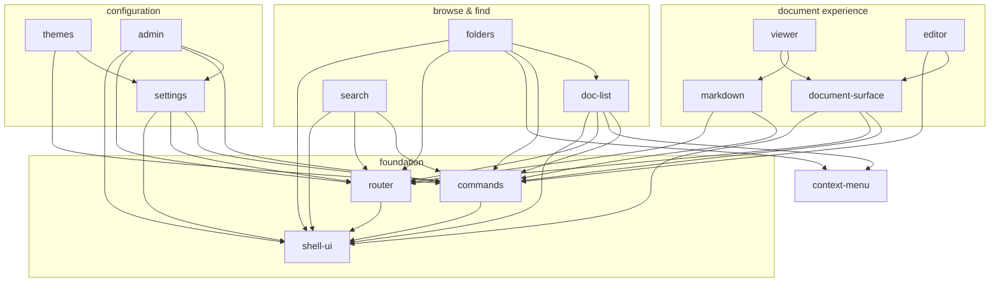

# `plugins/base/` — the base distribution

The visible app. Fourteen plugins that happen to ship with the server and are
[installed like any other](../SPEC.md#62-package-manifest-capabilities) — individually
replaceable, individually removable, and holding no privilege the kernel does not give
every plugin.

That is the whole point of the microkernel: **if the base distribution needed a special
case anywhere in the kernel, the kernel would be wrong.** This directory is also the
reference for writing a plugin — there is deliberately no scaffolding CLI (SPEC §10).

```
_shared/points.ts                 the extension points: names, types, shape validators
_shared/machine-docs.ts           the one rule three plugins share about hiding documents
_shared/fm-display.ts             what kind of thing an fm value is, and how to show one
_shared/compact.ts                "this is a phone": the breakpoint, and the hooks that read it
_shared/vite.plugin-config.mjs    the reference build config (SPEC §6.4)
_shared/vite.config.example.mjs   how a standalone plugin uses it
_shared/vite.config.tailwind.example.mjs  Tailwind-enabled standalone build
<id>/manifest.json                SPEC §6.2
<id>/src/index.tsx                `export default function activate(kernel) { … }`
<id>/src/style.css                linked on activation; classes prefixed per plugin
dist/<id>/<version>/              build output = the installed layout the server serves
```

| Plugin | Responsibility | Defines |
|---|---|---|
| `shell-ui` | layout, mobile breakpoint, a spot for the top bar, always-mounted overlays | `shell.header`, `shell.overlay`, `sidebar.panel`, `main.view` |
| `header` | the top bar: `start`/`end` seats (the ☰ is `shell-ui`'s item), the "Top bar" ordering setting | `navbar.item` |
| `context-menu` | the menu / sheet service: popover beside a button, bottom sheet on a phone | — |
| `notices` | the notice bell, in the header's `end` seat | — |
| `sync-status` | the sync pill, in the header's `end` seat | — |
| `router` | URL ↔ view (hash-based) | `router.route` |
| `commands` | command registry, palette, keybindings | `commands.command`, `keybindings.default` |
| `themes` | theme registry + picker; overrides kernel tokens | `themes.theme` |
| `search` | search UI; local index is the default provider | `search.provider` |
| `doc-list` | browse/sort/filter, new document, Trash | — |
| `folders` | drag-and-drop file tree over `fm.path`; every move is a splice | — |
| `markdown` | the unified/remark → React pipeline | `markdown.directive/fence/remark/component/taskState` |
| `document-surface` | the document route + mode registry | `document.mode` |
| `viewer` | read mode | contributes `read` |
| `editor` | edit mode (CodeMirror 6 + `y-codemirror.next`) | `editor.extension` |
| `settings` | the settings shell | `settings.section` |
| `admin` | users, invites, audit, orphans, snapshots, plugins | — |

That is the whole table. `calendar` and `agenda` — M4's proof plugins, which shipped here
and were never in `BASE_PLUGIN_IDS` — were **removed** on 2026-09-24 at the owner's
direction. They are in git history; nothing here depends on them, and nothing in the
server was written for them. The one thing that went with them is the only base plugin
that had a backend half, so **every plugin in this directory is now frontend-only**; a
`backend.wasm` still builds and installs exactly as before (`mise run wasm-plugins`,
`plugins/examples/hello-backend`), there is simply nothing in the base set using it.

## How the base plugins relate

Generated from the seventeen `manifest.json` `dependencies` fields — an arrow reads
**"depends on"**, and the loader's activation order is precisely a topological order of
this graph (a dependency always activates first; a failed dependency skips its whole
subtree). Every plugin additionally depends on `@kernel`, which is not drawn.



The graph is **unchanged by the core-improvements pass**: nothing declared a new
dependency. `folders` gained `react-dom` in `peerLibraries` (its move sheet is a
`createPortal`), which is a blessed runtime-layer specifier resolved through the server's
import map, not an edge in this graph. The one new cross-plugin relationship in that
pass — `folders` telling `doc-list` where unfiled documents go — is a `kernel.events`
message precisely *because* the arrow it would need points the wrong way: `folders`
already depends on `doc-list`, and the reverse edge would be a cycle the loader cannot
order.

Reading it bottom-up: `shell-ui` owns the frame everyone renders into, and `header`
fills its top-bar spot (the plugins that put items in the bar do not depend on `header`:
contributions to `navbar.item` buffer until it is defined); `router` and
`commands` are the two services almost everything consumes (URLs and actions); the
document experience stacks `viewer`/`editor` as peer *modes* on
`document-surface`, with `markdown` as the rendering pipeline `viewer` consumes; and
`folders` is the one browse plugin built on top of another (`doc-list`). Replacing any
node means satisfying its incoming arrows — nothing else.

## Machine-owned documents

`doc-list`, `folders` and `search` leave out any document whose `fm.path` starts with
`.` — the kernel's per-user settings documents (SPEC §6.4) are the ones that exist
today. The rule, the predicate and the DSL clause live in one place,
`_shared/machine-docs.ts`, precisely so the three cannot drift about what they are
hiding: a sidebar counting twelve above a list of eleven is the bug this replaced.

It is **a convention three plugins share, not a kernel concept.** The kernel knows one
domain model — a document is text — and "machine-owned" is not part of it (SPEC §2).
Nothing changes about what the server returns, what the local index holds or what
`kernel.documents` answers, every one of these documents stays readable, editable and
linkable, and `doc-list`'s filter bar and `search`'s results page each carry a toggle
that brings them back. A plugin that wants machine-owned documents of its own gets the
same treatment by filing them under a dotted path — there is no list of special paths
for anyone to keep up to date.

`folders` has no toggle, deliberately: a hidden folder in a tree is a row that looks
like every other folder and behaves differently, and a rename there would splice
`fm.path` on documents the kernel authors.

**Hiding is a read rule; the write needs its own.** Filtering a query protects what a
view *draws* and nothing else, and `folders` reaches its write path from places that
never ran the query: the `folders.moveDocument` command takes an id out of the URL, and
a drop reads `text/plain` off a `DataTransfer` any plugin may have filled in. Aimed at
the kernel's per-user settings document that wrote `fm.path` on it and moved it out of
`.settings`, where the settings host's own query is looking — leaving every stored
setting reading as its schema default. So `folders` checks the document's *stored*
`fm.path` at the splice (`refuseMachineWrite`), and refuses a dotted **destination** too,
because `.hidden` typed into an inline folder rename is the same hole from the other
side. Anyone adding a write here inherits that obligation; `EXCLUDE_MACHINE_DOCUMENTS` on
a subscription is not it.

## Two shared files, and why each is not a dependency

`_shared/` holds what several base plugins must agree about *exactly*, where a manifest
dependency would be the wrong shape of agreement.

- **`machine-docs.ts`** — above. Three plugins, one rule about what to hide.
- **`fm-display.ts`** — what kind of thing an `fm` value is (`inferKind`, `isDateKey`,
  `PREFERRED_KEY_ORDER`) and how to print one for a reader (`fmDisplayRows`,
  `formatDateValue`). `viewer` draws read mode's properties header from it. It was
  shared with the `properties` editing panel, removed on 2026-09-26; it stays in
  `_shared` so the next plugin that shows frontmatter types values the same way.

## The folder tree

`folders` renders folders *and* documents as one `role="tree"`: a document with no
`fm.path` is a row at the root, beside the top-level folders, because that is where it
is. Dragging a document onto a folder is one `setFrontmatterValue`; onto **Root** it is
one `removeFrontmatterKey`; dragging a *folder* is one splice per document inside it,
planned first (`src/moves.ts`) so the move has a total to show progress against and can
be re-planned against the live projection after a partial failure. A folder is only a
prefix, so dropping `a/notes` into `b` when `b/notes` exists **merges** them — there is
no record to collide.

Two things `fm.path` alone cannot express, both held in this plugin's own per-user
settings: a folder that holds no document yet (`emptyFolders`, dropped the moment one
lands in it) and which folders the user has **collapsed** (stored as the negative, so an
untouched tree is open). `emptyFolders` is a whole list under one settings key, so two
devices creating a folder at the same moment write it concurrently and the host keeps one
line (SPEC §3.3, last occurrence wins) — which silently lost the folder made on the
losing device. A write is therefore **merged, not adopted**: entries this device wrote and
has not yet read back are folded into the stored list (`mergeTracked`), and an entry stops
being defended the first time a stored value contains it, so a folder deleted later on
another device stays deleted. A stale entry costs nothing (the tree draws it from
`fm.path` anyway); a dropped one is a folder the user made and cannot see. Everything reachable by drag is reachable without one — a
long-press, a right-click, the row's `⋯`, or `M` opens a portalled sheet with Move to…,
New document/folder here, Rename and Delete — because HTML5 drag and drop does not fire
from touch.

## Building

```bash
mise run plugins                 # all of them, into plugins/base/dist
cd web && node scripts/build-plugins.mjs editor markdown    # just these two
```

The build runs from `web/` (that is where `vite` and the type declarations live) and each
plugin becomes one ES module with the **blessed runtime layer externalized** — `react`,
`yjs`, `@kernel`, the CodeMirror and remark families stay bare specifiers and resolve
through the server's import map at load time. A plugin that bundled its own React would
get its own React, and hooks and context would break across the boundary in ways that look
like a kernel bug.

Typechecking happens through `web/tsconfig.json` (`mise run web-check`), which includes
this directory. There is no `node_modules` here and there does not need to be: everything
a base plugin imports is either relative or external.

## Writing one

```tsx
import type { Kernel } from "@kernel";

export default function activate(kernel: Kernel) {
  kernel.extensions.contribute("navbar.item", { id: "hello", label: "Hello" });
  return { greet: () => "hi" };      // this plugin's API, for its declared dependents
}
```

Five things worth knowing before the first line:

1. **The `kernel` you are handed is yours.** Contributions, settings, your `%%%` section,
   your log lines and your service access are all attributed to your plugin id without you
   passing one. You cannot act as another plugin, and it cannot act as you.
2. **Activation is reload-only, in topological order.** By the time your `activate` runs,
   every declared dependency has returned its API; `kernel.services.require("markdown")`
   is synchronous and cannot be undeclared.
3. **Throwing from `activate` fails your plugin and skips everything that depends on it**,
   with one aggregated notice. Fail loudly and early rather than half-registering.
4. **Never rewrite frontmatter or another plugin's `%%%` section.** `kernel.documents.splice`
   is the only sanctioned write path for metadata (SPEC §3.3), and it is mandatory
   discipline, not a convenience.
5. **Read locally.** `kernel.documents.query/subscribe/search` run against the replicated
   projection, online or offline. Reaching for `/api/documents` to browse is a bug.

Types: `import type { Kernel } from "@kernel"`. Outside this repository, fetch
`/kernel.d.ts` from your server — it is generated from the contract that server
implements, which is the one that matters when a workspace is behind.

## Trust, stated plainly

Installing a plugin runs its frontend code **unsandboxed** in every user's session: full
DOM, full workspace, the user's credentials. `capabilities` in the manifest gate *server*
host functions and native bridge calls, not this. Frontend isolation is v2 research
(SPEC §6.1, §10). The recovery paths, in order of severity: `?safe=1` (base plugins only),
`?safe=bare` (no plugins, built-in manager), `DISABLE_PLUGINS=1` on the server.
